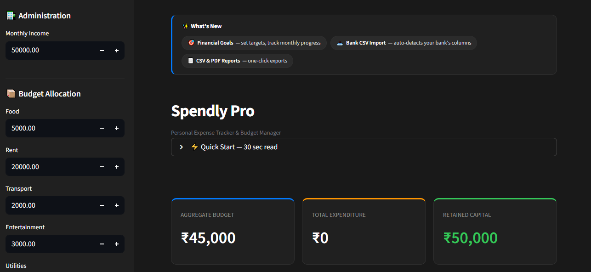
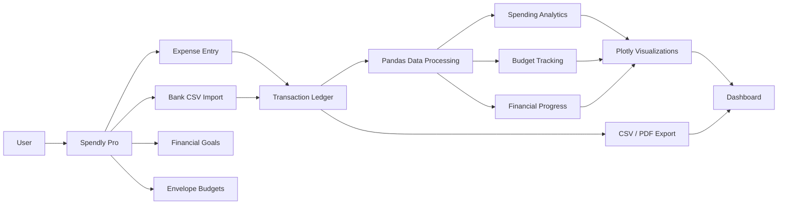

# 💳 Spendly Pro

<div align="center">

### Personal Finance, Reimagined for Focus.

A modern personal finance and expense tracking application built with simplicity, speed, and clarity in mind.


</div>

---



---

[**Launch Live Application**](https://myspendly.streamlit.app/) • [View Repository](https://github.com/AryaBuwa/MySpendly)

Spendly Pro is a high-performance, minimalist expense tracker inspired by the design languages of **Apple** and **Notion**. Built on Streamlit, it combines the structural clarity of a digital ledger with the visual depth of modern financial dashboards.

---

## 🏗️ Application Architecture


---

## ⚡ Quick Start

New here? This is genuinely a 30-second read — it's also built directly into the app under **Quick Start**.

1. **Log spend** — fill the form, hit *Confirm Entry*.
2. **Set budgets** — adjust envelope limits in the sidebar.
3. **Import statements** — upload a bank CSV to bulk-add transactions.
4. **Track goals** — add a savings target to see monthly progress.
5. **Export** — grab a CSV or PDF report anytime, top-right.

---

## 🎨 Design Philosophy

Spendly Pro is built for users who value **aesthetics as much as utility**.

* **Minimalist UI:** A deep-charcoal interface utilizing the `Inter` typeface for maximum legibility.
* **Deliberate Hierarchy:** Primary actions, destructive actions, and neutral actions are visually distinct — no guessing what a button will do.
* **Tactile Feedback:** Notion-style color-coded tags for instant category recognition, plus accent-edged metric cards for at-a-glance scanning.
* **Apple-Inspired Alerts:** Dynamic status badges that distinguish between "Today" and historical entries.
* **Guarded by Design:** Destructive actions (deleting a transaction, resetting the database) require a second confirmation tap before anything is lost.

---

## ✨ Key Features

### 📊 **Intelligent Analytics**
* **The Doughnut Allocation:** A high-contrast visualization of your spending distribution.
* **Activity Heatmap:** A 30-day GitHub-style grid to track spending frequency.
* **Live Metrics:** High-level summary cards for **Capacity**, **Expenditure**, and **Savings**, each with a color-coded accent edge.

### ⚙️ **Envelope Budgeting**
Manage your finances using the digital envelope method. Customize limits for core categories including Food, Rent, Transport, Fun, and Bills.

### 🎯 **Financial Goals**
Set a savings target, name it, give it a deadline, and let Spendly work out how much you need to save each month — tracked against your Retained Capital automatically.

### 📥 **Bank Statement Import**
Upload a CSV exported from your bank (SBI, HDFC, ICICI, Axis, Kotak, and more). Columns are auto-detected, credits are filtered out automatically, duplicates are caught, and you get a full editable preview before anything is imported.

### 📂 **Data Sovereignty**
* **Instant Ledger:** Fast, responsive logging with a UUID-backed transaction system.
* **CSV & PDF Export:** One-click download for auditing in Excel or Apple Numbers, or a formatted PDF summary report.
* **Deep Search:** A powerful filter to drill down through transactions instantly.
* **Confirm-to-Delete:** Every destructive action — deleting a transaction or resetting the database — asks you to confirm first.

---

## 🛠️ Technical Stack & Installation

| Component | Technology |
| :--- | :--- |
| **Framework** | Streamlit |
| **Data Engine** | Pandas |
| **Visualization** | Plotly (Graph Objects) |
| **Reports** | FPDF |
| **Styling** | Custom CSS3 & HTML Injection |

**Local Setup:**
```bash
git clone https://github.com/AryaBuwa/MySpendly.git && cd MySpendly
pip install -r requirements.txt
streamlit run app.py
```

---

### Experimental

**Currently exploring LLM-powered insights and advanced automation.**

---

## 📝 Changelog & Roadmap

### **v1.1.0** — *Current Release*
> **UI Polish & New Feature Launch**
* **UI:** Reworked button hierarchy — primary, neutral, and destructive actions now look distinct.
* **UI:** Metric cards gained color-coded accent edges for faster scanning.
* **Safety:** Delete and Reset Database actions now require a confirmation step.
* **Onboarding:** Added an in-app 30-second Quick Start guide and a "What's New" strip.
* **Feature:** Financial Goals — set targets, track monthly progress.
* **Feature:** Bank CSV Import — auto-detects columns across major Indian banks.
* **Feature:** CSV and PDF export with formatted monthly financial reports.

### **v1.0.0**
> **Initial Stable Build**
* **Design:** Implementation of the Apple/Notion Dark Mode UI using custom CSS injection.
* **Logic:** Core "Envelope" budgeting system for categorized financial tracking.
* **Data:** Interactive 30-day expenditure heatmap.
* **ID System:** UUID-backed transaction logging for precise record management.

### **Planned Features (Roadmap)**
* [ ] **Multi-Currency Support:** Automatic conversion for international use.
* [ ] **Recurring Transactions:** Automation for monthly subscriptions and rent.
* [ ] **Visual Alerts:** Notifications when an "Envelope" exceeds 80% of its capacity.

---

## 🛡️ Usage Policy & Protection

**All Rights Reserved.** *To ensure the integrity of the project and protect the original work:*

* **Personal Use Only:** This application is intended for individual financial tracking and educational purposes.
* **No Unauthorized Redistribution:** You may fork this repository for personal learning, but you may **not** re-publish this application under a different name or use it for commercial profit without explicit written permission.
* **No Malicious Use:** Any attempt to reverse-engineer the application to inject malicious code or disrupt the hosted service is strictly prohibited.
* **Data Privacy:** This app does not store data on a permanent server; all data lives in your browser session. **Export your CSV regularly** to avoid data loss.

> [!CAUTION]
> **Disclaimer:** The author is not responsible for any financial decisions made based on the data provided by this app. Use at your own risk.